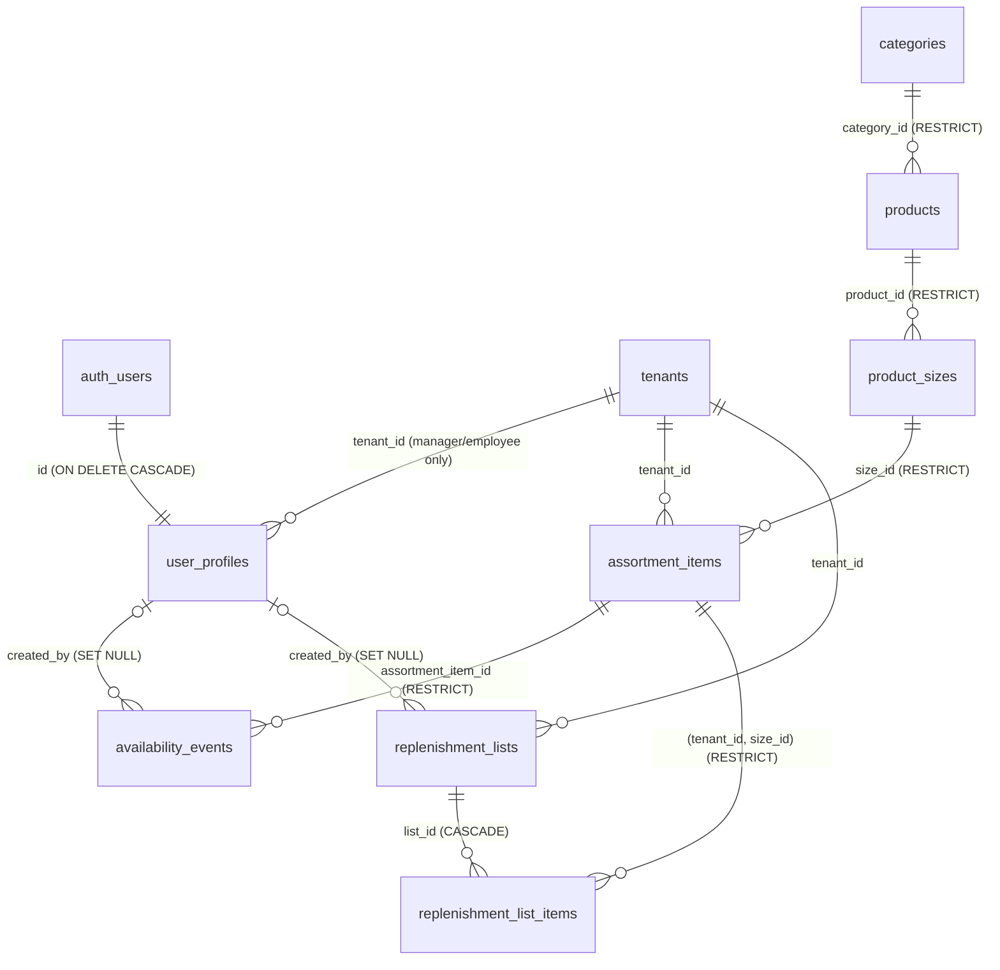

# REPMA — Database Architecture (database.md)

> Definitive design of REPMA's PostgreSQL schema, the multi-tenant availability management platform.
> Related documents: `spec.md` (requirements) and `architecture.md` (system architecture, AD-xx decisions).

---

## 1. Design principles

1. **The API is the database's only client.** The frontend never connects to Postgres or Supabase; everything goes through the Express API.
2. **Defense in depth with RLS.** The API connects with a dedicated role **without Row-Level Security bypass**: even if an application query forgot the tenant filter, the database blocks cross-tenant access (AD-01).
3. **Global catalog, per-store availability.** Categories, products and their sizes exist only once and are managed by the Platform Admin; each tenant (store) has its own assortment, availability state and history — held per size, the sellable unit (AD-06/07).
4. **Availability is an immutable event log.** The current `is_available` flag is a cache of the latest event; the event history is immutable at the database level (AD-04). REPMA tracks no quantity balances anywhere: staff flag sizes as out of stock or restocked, and the events record it.
5. **Invariants live in the DB.** Uniqueness constraints, checks, cascades and policies are declared in the schema — the application respects them, it does not replace them.

The database is **Supabase**'s managed Postgres (AD-02): Supabase **Auth** provides identity (`auth.users`, JWT) and Supabase **Storage** stores product images (the DB only persists the URL). Application data access is a **direct Postgres connection** via Drizzle (AD-03); Supabase's REST API (PostgREST) is not used and is revoked (§7.4).

---

## 2. Schema conventions

| Convention | Value |
|---|---|
| Names | `snake_case`, plural table names |
| PK | `id uuid PRIMARY KEY DEFAULT gen_random_uuid()` (AD-17: prevents id enumeration across tenants and simplifies seeds) |
| Timestamps | `created_at` / `updated_at timestamptz NOT NULL DEFAULT now()`; `updated_at` maintained by trigger (§6). The event log is the exception: `created_at` only |
| Enumerated types | Native Postgres enums (§5) instead of lookup tables: the value domain is closed, participates in CHECKs/policies and avoids joins without contributing additional data |
| Quantities | `integer` with CHECKs (whole units; no decimals in the MVP) |
| Text fields | `text` with limits validated in the API (Zod); the DB only enforces the structural |
| Multi-tenancy | Shared schema: tenant-scoped tables carry `tenant_id uuid NOT NULL` with FK and RLS policy (§7) |

---

## 3. Entity-relationship diagram



Two zones:

- **Global** (no `tenant_id`): `tenants`, `user_profiles`, `categories`, `products`, `product_sizes`.
- **Tenant-scoped** (with `tenant_id`): `assortment_items`, `availability_events`, `replenishment_lists`, `replenishment_list_items`.

---

## 4. Tables

### 4.1 `tenants` — stores

| Column | Type | Null | Notes |
|---|---|---|---|
| id | uuid | PK | |
| name | text | no | |
| slug | text | no | **UNIQUE**; readable and stable identifier |
| is_active | boolean | no | default `true`; deactivation suspends the store's operation |
| created_at / updated_at | timestamptz | no | |

Tenants are **never deleted**: they are deactivated (`is_active = false`). This way the availability and user history is never orphaned and suspension is reversible.

### 4.2 `user_profiles` — application profile (1:1 with `auth.users`)

| Column | Type | Null | Notes |
|---|---|---|---|
| id | uuid | PK | FK → `auth.users(id)` **ON DELETE CASCADE**: deleting the identity deletes the profile |
| email | text | no | **UNIQUE**; denormalized copy of `auth.users.email`, written at creation and never edited (RF-11) — gives `GET /users` plain-SQL listing and search (RF-09) without granting `repma_api` anything on the `auth` schema |
| full_name | text | no | |
| role | `user_role` | no | `platform_admin` \| `manager` \| `employee` |
| tenant_id | uuid | yes | FK → `tenants` **ON DELETE RESTRICT** |
| is_active | boolean | no | default `true` |
| created_at / updated_at | timestamptz | no | |

**CHECK `user_profiles_role_tenant_coherence`** — role/store coherence is structural:

```sql
CHECK (
  (role = 'platform_admin' AND tenant_id IS NULL)
  OR (role IN ('manager','employee') AND tenant_id IS NOT NULL)
)
```

Credentials live in `auth.users` (Supabase Auth); the profile adds what the application needs (role, store, status) plus a denormalized `email` — the same trade as the denormalized `tenant_id` (§10): a redundant column in exchange for plain SQL, coherent by construction because the email is written once at creation and is never editable (RF-11). Exactly one role per user and one store per store user (AD-09); the Platform Admin belongs to none. The store assignment is **immutable after creation** and role changes never cross it (manager ↔ employee only, RN-01) — enforced by the API (the CHECK above guards coherence, not immutability); it is what keeps §7.3's profile-readability guarantee true, since an author's profile can never move out of the store where their events live.

### 4.3 `categories` — global catalog

| Column | Type | Null | Notes |
|---|---|---|---|
| id | uuid | PK | |
| name | text | no | |
| slug | text | no | **UNIQUE**; generated by the API from the name (normalization in a single place, unit-testable) |
| description | text | yes | |
| created_at / updated_at | timestamptz | no | |

A category with products cannot be deleted (`RESTRICT` FK from `products`).

### 4.4 `products` — global catalog

| Column | Type | Null | Notes |
|---|---|---|---|
| id | uuid | PK | |
| name | text | no | |
| category_id | uuid | no | FK → `categories` **ON DELETE RESTRICT** |
| description | text | yes | |
| image_url | text | yes | Public URL from the Supabase Storage bucket |
| is_active | boolean | no | default `true` |
| created_at / updated_at | timestamptz | no | |

A product is the **grouping** unit — name, image, category, description; the sellable/trackable unit is the size (§4.5), which carries the SKU. Product deletion is **soft** (`is_active = false`): a product's sizes may be referenced by assortments, the event history and lists of any store, and that history is untouchable. An inactive product is no longer offered for new assortment additions but remains readable wherever it already exists.

The model is `Category → Product → Size → Assortment`. The evolution originally deferred as PD-01 (a flat product model, with a size level introduced only if sizes/colors demanded it) was adopted into the MVP: `product_sizes` sits between `products` and `assortment_items` exactly where it was anticipated, and the rest of the schema is unchanged.

### 4.5 `product_sizes` — global catalog (sellable units)

> Formerly named `product_variants` — renamed so the docs and future code say "size", the term users think in.

| Column | Type | Null | Notes |
|---|---|---|---|
| id | uuid | PK | |
| product_id | uuid | no | FK → `products` **ON DELETE RESTRICT** |
| label | text | no | e.g. `"42"`, `"M"`, `"One size"` |
| sku | text | no | **UNIQUE**; the business identifier lives on the size, not the product |
| position | integer | no | default `0`; display order |
| is_active | boolean | no | default `true` |
| created_at / updated_at | timestamptz | no | |

**UNIQUE `(product_id, label)`** — no duplicate labels within a product.

The size is the unit that is tracked and replenished: `assortment_items` and `replenishment_list_items` reference sizes, never products directly. Every product has **at least one size**; non-sized products get a single size labeled `"One size"`. This ≥1 invariant is enforced by the API (product creation requires at least one size), not by the DB.

Like products, sizes are **soft-deactivated** (`is_active = false`) and never hard-deleted: the RESTRICT FK from `assortment_items` protects any referenced size, and, as with products, the API role has no DELETE grant (§7.1).

Size presets (Clothing `XS/S/M/L/XL/2XL`, Footwear `36–45`, default `One size`) are **app-level constants in `packages/shared`** used to prefill the UI when creating sizes — they are **not** database objects; any label is valid as long as it is unique within the product.

### 4.6 `assortment_items` — per-store assortment and availability

| Column | Type | Null | Notes |
|---|---|---|---|
| id | uuid | PK | |
| tenant_id | uuid | no | FK → `tenants` **ON DELETE RESTRICT** |
| size_id | uuid | no | FK → `product_sizes` **ON DELETE RESTRICT** |
| is_available | boolean | no | default `true`; **cached state**, derived from the event history (§4.7) |
| created_at / updated_at | timestamptz | no | |

**UNIQUE `(tenant_id, size_id)`** — a size appears at most once in a store's assortment.

A row here means "this store offers this size": it is the **assortment** (managed by the manager) in addition to the current availability. There are no quantities and no thresholds: availability is **per size** and binary — a size is either available or out of stock.

`is_available` is a **cache of the event log**: its only write path is the availability service, which within the same transaction inserts into `availability_events` and executes `UPDATE … SET is_available = <state implied by the event>`. At the API level the rule is explicit: no endpoint accepts `is_available` as an editable field — staff change availability exclusively by recording events (flagging a size as out of stock or restocked).

An assortment item can be **removed** (`DELETE`, RF-44) only while nothing references it: no availability events and no replenishment list lines (RN-13). Both conditions are structural — the RESTRICT FKs from `availability_events` (§4.7) and `replenishment_list_items` (§4.9) block anything else — and the API checks them first to return a clean 409. Removal exists to correct a mistaken addition, never to erase history: an item with events is permanent.

### 4.7 `availability_events` — immutable event history

| Column | Type | Null | Notes |
|---|---|---|---|
| id | uuid | PK | |
| tenant_id | uuid | no | FK → `tenants` **ON DELETE RESTRICT**; redundant with the assortment item's, needed for the RLS policy without a join (§7.3) |
| assortment_item_id | uuid | no | FK → `assortment_items` **ON DELETE RESTRICT**: an item with history is never deleted |
| type | `availability_event_type` | no | `out_of_stock` \| `restock` |
| created_by | uuid | yes | FK → `user_profiles` **ON DELETE SET NULL**: if the author disappears, the entry remains |
| created_at | timestamptz | no | no `updated_at`: entries are never edited |

It is an **immutable event log**: INSERT and SELECT only. There are no UPDATE/DELETE RLS policies (§7.3) nor UPDATE/DELETE GRANTs for the API role (§7.1) — immutability is guaranteed by two independent layers.

**System invariant:** for every assortment_item, `is_available` equals the state implied by its **latest** event (`out_of_stock` → `false`, `restock` → `true`); an item with no events is available (`true`). The single write path is the availability service, which inserts the event and updates the flag in one transaction. The history is **strictly alternating** (RN-14): the service rejects an event whose type matches the current state (409), checked inside that same transaction and serialized by the row lock the flag update takes on `assortment_items` — so the latest `out_of_stock` event is always the start of the current outage, the timestamp aging reads (DP-07). The integration suite verifies the invariant, including under concurrency (two simultaneous same-type flags → one event, one 409).

Type semantics: `out_of_stock` (staff flag the size as depleted), `restock` (the size is back on the shelf). An event carries nothing but its type, its author and its timestamp (RN-06): no quantity, no note — availability is binary and the schema stores no unit counts anywhere.

### 4.8 `replenishment_lists` — per-store replenishment lists

| Column | Type | Null | Notes |
|---|---|---|---|
| id | uuid | PK | |
| tenant_id | uuid | no | FK → `tenants` **ON DELETE RESTRICT** |
| name | text | no | |
| status | `replenishment_status` | no | `draft` \| `processing` \| `done`; default `draft` |
| notes | text | yes | |
| created_by | uuid | yes | FK → `user_profiles` **ON DELETE SET NULL** |
| created_at / updated_at | timestamptz | no | |

`status` is an editable field, with no enforced state machine: it reflects operational progress (draft → processing → done).

Lists have no generated origin: their lines are added by hand, one at a time (RF-28). Nothing in this table or in `replenishment_list_items` is derived from `assortment_items.is_available` — availability and replenishment are independent by product decision (DP-06). The list is a per-store manual working document.

### 4.9 `replenishment_list_items` — lines of a list

| Column | Type | Null | Notes |
|---|---|---|---|
| id | uuid | PK | |
| tenant_id | uuid | no | FK → `tenants` **ON DELETE RESTRICT**; redundant with the list's, for RLS without a join (§7.3) — and first column of the composite FK below |
| list_id | uuid | no | FK → `replenishment_lists` **ON DELETE CASCADE**: deleting the list deletes its lines |
| size_id | uuid | no | with `tenant_id`, composite FK `(tenant_id, size_id)` → `assortment_items (tenant_id, size_id)` **ON DELETE RESTRICT** (referencing its UNIQUE) — a list only references sizes in the store's assortment (RN-12); the RESTRICT also blocks removing an assortment item while any list references it (RF-44/RN-13) |
| quantity_requested | integer | no | **CHECK `quantity_requested > 0`** |
| is_done | boolean | no | default `false`; shop-floor progress check (RF-40) |
| created_at / updated_at | timestamptz | no | |

**UNIQUE `(list_id, size_id)`** — a size appears at most once per list.

**A list only references sizes the store carries (RN-12)**: the composite FK to `assortment_items` makes it structural; the API validates it first so the user gets a clean 400 instead of a raw FK error. Assortment membership — not product/size activity — is the criterion: an inactive size already in the assortment can still be listed (RN-08).

`is_done` marks a line as already handled so staff can resume a half-finished list. Items are managed individually with immediate persistence (RF-28), and the check is toggled through the same per-item `PATCH` (RF-40); new lines always start unchecked. It is progress state, not a quantity: nothing is computed from it beyond the compact `done/total` fraction.

---

## 5. Enumerated types

```sql
CREATE TYPE user_role               AS ENUM ('platform_admin', 'manager', 'employee');
CREATE TYPE availability_event_type AS ENUM ('out_of_stock', 'restock');
CREATE TYPE replenishment_status    AS ENUM ('draft', 'processing', 'done');
```

All three domains are closed and stable; a new value is a migration (`ALTER TYPE … ADD VALUE`), which is exactly the level of friction desired: changing the domain of a role or an event type **must** be a conscious, versioned change. The same literals are exported as typed constants in `packages/shared`, so API, frontend and DB share a single source of values.

---

## 6. Functions and triggers

| Object | Type | What it does |
|---|---|---|
| `set_updated_at()` | plpgsql trigger function | `NEW.updated_at := now()` |
| `set_updated_at` | BEFORE UPDATE trigger | on all tables **except** `availability_events` (immutable, no `updated_at`) |

`assortment_items` does carry `updated_at` — its cached flag is updated by the availability service — so the trigger applies there like everywhere else; only the event log is exempt.

Deliberately no further logic lives in triggers: slugs are generated by the API (unit-testable normalization) and the latest-event invariant is guaranteed by the availability service within its transaction. The DB provides structure and isolation; behavior lives in the service layer, where it is visible and testable.

---

## 7. Security: roles, RLS and multi-tenancy

### 7.1 Connection roles

| Role | Use | Capabilities |
|---|---|---|
| `postgres` (Supabase) | Migrations and seed | Schema owner; `BYPASSRLS` — never used by the application at runtime |
| **`repma_api`** | The API at runtime (`DATABASE_URL`) | `LOGIN`, `NOSUPERUSER`, **no `BYPASSRLS`** → subject to all RLS policies |

Minimal GRANTs for `repma_api` (everything not listed is denied):

| Table | SELECT | INSERT | UPDATE | DELETE |
|---|:-:|:-:|:-:|:-:|
| tenants | ✔ | ✔ | ✔ | — |
| user_profiles | ✔ | ✔ | ✔ | — ¹ |
| categories | ✔ | ✔ | ✔ | — ² |
| products | ✔ | ✔ | ✔ | — ² |
| product_sizes | ✔ | ✔ | ✔ | — ² |
| assortment_items | ✔ | ✔ | ✔ ⁴ | ✔ ³ |
| availability_events | ✔ | ✔ | — | — |
| replenishment_lists | ✔ | ✔ | ✔ | ✔ |
| replenishment_list_items | ✔ | ✔ | ✔ | ✔ |

¹ User deletion is performed in Supabase Auth (admin API); the `user_profiles` row falls via the cascade from `auth.users`, which referential actions execute with the owner's privileges.
² Soft delete via `is_active`.
³ DELETE covers exactly one operation: removing an item nothing references — no events, no replenishment list lines (RF-44/RN-13). The RESTRICT FKs from `availability_events` and `replenishment_list_items` make any other delete impossible; an item with history is permanent.
⁴ UPDATE on `assortment_items` covers exactly one write: the cached `is_available` flag update **inside the availability service's transaction** (§4.6). No endpoint exposes `is_available` as an editable field.

### 7.2 Session context (GUCs)

Every API operation runs inside a transaction that sets the authenticated context using local variables:

```sql
BEGIN;
SELECT set_config('app.user_id',  '<uuid>',  true);  -- true = local to the transaction
SELECT set_config('app.role',     '<role>',  true);
SELECT set_config('app.tenant_id','<uuid>',  true);  -- empty on platform routes
-- … request queries …
COMMIT;
```

- `set_config(..., true)` is the parameterizable equivalent of `SET LOCAL`: the value dies with the transaction, which makes it **safe with connection pooling** (no reused connection carries someone else's context).
- Policies read the context with `current_setting('app.…', true)` (*missing_ok*): if the context is not set, it returns `NULL`, every comparison is `false` and the result is **deny-by-default**.
- Who sets what: store users always carry their own `tenant_id`; the Platform Admin carries that of the store being operated on (`X-Tenant-Id` header validated by the API) or none on platform routes. See `architecture.md` §5.2.

Compatibility note: this pattern requires the connection to hold the full transaction (pooling in *session* or *transaction* mode; never *statement*).

### 7.3 RLS policies

RLS with `ENABLE` + **`FORCE`** on all 9 tables (FORCE subjects even an owner without `BYPASSRLS`). No table has a universal permissive policy: without context there are no rows.

Abbreviations: `uid() = current_setting('app.user_id', true)::uuid`, `rol() = current_setting('app.role', true)`, `tid() = current_setting('app.tenant_id', true)::uuid` (expressed inline in the actual policies).

| Table | SELECT | INSERT / UPDATE | DELETE |
|---|---|---|---|
| tenants | `rol() = 'platform_admin' OR id = tid()` (a store sees its own record) | only `rol() = 'platform_admin'` | no policy (never deleted) |
| user_profiles | `rol() = 'platform_admin' OR id = uid() OR tenant_id = tid() OR role = 'platform_admin'` (own row, same-store members, every platform admin) | only `rol() = 'platform_admin'` | no policy ¹ |
| categories, products, product_sizes | any authenticated context: `uid() IS NOT NULL` | only `rol() = 'platform_admin'` | no policy (soft delete) |
| assortment_items | `tenant_id = tid()` | `tenant_id = tid()` (USING and WITH CHECK) | `tenant_id = tid()` (RF-44: only unreferenced items — the RESTRICT FKs enforce it) |
| availability_events | `tenant_id = tid()` | INSERT: `tenant_id = tid() AND created_by = uid()`; **no UPDATE policy** | **no policy** → immutable event log |
| replenishment_lists | `tenant_id = tid()` | `tenant_id = tid()` | `tenant_id = tid()` |
| replenishment_list_items | `tenant_id = tid()` | `tenant_id = tid()` | `tenant_id = tid()` |

¹ The cascade from `auth.users` is not subject to RLS (referential action).

Design notes:

- **RLS isolates; the RBAC matrix authorizes.** The policies guarantee *isolation* (no one touches another store's data; only the Platform Admin writes to global data). Fine-grained per-role authorization (e.g. which roles may edit the assortment or record availability events) is the responsibility of the permission matrix in the API (`architecture.md` §6). This way each layer has a clear responsibility and the policies stay simple and auditable.
- The Platform Admin has **no bypass** on tenant-scoped tables: to operate inside a store, they set their `app.tenant_id` like any member. A single access path = a single path to test.
- `tenant_id` is **denormalized** in `availability_events` and `replenishment_list_items` so that their policies are a column comparison, without subqueries to the parent table: simpler, faster and free of policy recursion. Coherence with the parent is guaranteed by the service (same transaction) and verified by the integration suite.
- **Profiles are readable wherever their name can appear.** A store user reads their own row, their store's members (`tenant_id = tid()`) and every platform admin's row (`role = 'platform_admin'`): author and creator names surface across the product — event authors (RF-21/RF-23), replenishment list creators — and "—" must remain the exclusive mark of a **deleted** user (RN-09), never of a live one the reader happens not to be allowed to select. Another store's members stay invisible: the isolation suite includes reading tenant B's profiles from tenant A's context. The guarantee relies on RN-01's immutability — a user never changes store nor crosses into or out of the platform role (§4.2), so an event author's profile can never migrate beyond its readers' reach.
- Session bootstrap: to load the freshly authenticated user's profile, the API sets only `app.user_id` (extracted from the verified JWT) and reads `user_profiles` — the `id = uid()` policy allows exactly that row. With the profile loaded it can then set `app.role` and `app.tenant_id` for the rest of the request.

### 7.4 Closing the perimeter

- `REVOKE ALL` on schema tables, sequences and functions for the PostgREST roles `anon` and `authenticated`, including `ALTER DEFAULT PRIVILEGES` for future objects: Supabase's auto-generated REST API is not a door to the data.
- The frontend holds no Supabase key; only the API has `DATABASE_URL` (role `repma_api`) and the service key (exclusively for Auth admin and Storage, never for data).
- **Isolation tests in CI**: the integration suite sets tenant A's context and attempts to read/write every tenant-scoped table of tenant B, expecting 0 rows or an error; it also verifies deny-by-default without context and the event log's immutability. It is the most important test in the project and blocks the build.

---

## 8. Indexes

In addition to the implicit indexes from PKs and UNIQUEs (`tenants.slug`, `user_profiles.email`, `categories.slug`, `product_sizes.sku`, `product_sizes(product_id, label)`, `assortment_items(tenant_id, size_id)`, `replenishment_list_items(list_id, size_id)`):

| Index | Table | Rationale |
|---|---|---|
| `(tenant_id)` partial `WHERE tenant_id IS NOT NULL` | user_profiles | listing users by store |
| `(category_id)` | products | catalog filtering by category |
| `(tenant_id) WHERE NOT is_available` | assortment_items | **out-of-stock** view: partial index containing only the unavailable rows (the `outOfStock=true` filter and the Home out-of-stock block) |
| `(assortment_item_id, created_at DESC)` | availability_events | paginated event history of an item in reverse chronological order |
| `(tenant_id, created_at DESC)` | availability_events | recent store activity, tenant-wide event feed (Activity page, RF-42) |
| `(tenant_id, created_at DESC)` | replenishment_lists | listing the store's lists — also serves Home's open-work block and the index page's date-range filter (`from`/`to`), a range on the index's second column. `status IN (…)` and the name `search` are residual filters over one page's worth of rows, not a reason for a second index |
| `(product_id)` | product_sizes | serves the "sizes of a product" listing (and FK support — Postgres does not index FKs automatically) |

**Deliberately un-indexed FKs**: `assortment_items.size_id`, `replenishment_list_items`' composite `(tenant_id, size_id)` and the `created_by` columns (`availability_events`, `replenishment_lists`) get no index — no query filters by them, and the referential actions they would support are either impossible (sizes are never deleted) or rare enough (a user deletion's `SET NULL`, an assortment removal's RESTRICT check — RF-44) that an occasional scan beats a permanent index at these volumes. FKs to `tenants` need no support either: tenants are never deleted. Indexes exist only where a real query needs them.

The grouped availability listing (AD-22) needs no index of its own: it reads the same tenant slice through the UNIQUE below and joins up to `product_sizes`/`products` over their PKs. The `productId` filter (RF-18, the `/catalog` cross-reference) narrows that same read before grouping and needs no index either. Its default order is **aging descending** (RF-18): the sort key is the oldest `created_at` among the latest `out_of_stock` events of each product's run — the partial out-of-stock index above finds the unavailable items and `(assortment_item_id, created_at DESC)` serves each one's latest event; products with nothing out of stock follow, ordered by name. The sort runs over the tenant's filtered assortment before pagination — hundreds of rows at these volumes, the same cost class this section already accepts for `ILIKE`. The aging figure each row carries (DP-07) is that same latest-event `created_at`: the sort key and the figure come from one read.

The UNIQUE `(tenant_id, size_id)` on `assortment_items`, with `tenant_id` in first position, also serves as the index for all accesses to a store's assortment. Text searches (`search`) use `ILIKE` at these volumes; should size ever demand it, the documented next step is `pg_trgm` + a GIN index (not in the MVP).

---

## 9. Seed

The seed (versioned alongside the migrations, executed with the administrator role) leaves a complete and coherent demo:

- **Users** (in `auth.users` + `user_profiles`, demo password documented in the README):
  - 1 Platform Admin (`admin@repma.demo`).
  - 2 stores — e.g. *Downtown Store* and *North Store* — each with 1 manager and 1 employee (`manager.downtown@repma.demo`, `employee.downtown@repma.demo`, …).
- **Global catalog**: ~6 generic sports-retail categories (footwear, apparel, accessories, sports electronics, nutrition, equipment) and ~40 products with description, each seeded **with its sizes**: apparel with `XS–2XL`, footwear with a subset of `36–45`, the remaining categories with a single size labeled `"One size"`. SKUs live on the sizes.
- **Availability**: each store with a different assortment of **sizes** (shared and exclusive, so that isolation is visible in the demo), with **several sizes flagged out of stock** so the out-of-stock view is populated from the very first startup. Flags come with **event history**: alternating `out_of_stock` and `restock` events — the only shape the service accepts (RN-14). The seed respects the latest-event invariant — `is_available` always matches the item's latest event, never a hand-written flag.
- **Replenishment**: several lists per store across the three statuses — at least two open (a `processing` one with some lines marked done, `is_done = true`, plus a couple of `draft`s, one of them empty) and one `done` — so the progress check and bar, Home's open-work block with more than one line, and the "—" of an empty list are all visible from the first startup.
- **Storage**: public product-image bucket; the seed's URLs point to it.

Migrations (Drizzle) + seed reproduce the database from scratch locally (`supabase start`), in CI and on a fresh Supabase project, with no manual steps.

---

## 10. PostgreSQL decisions

| Decision | Choice and why |
|---|---|
| `uuid` PKs with `gen_random_uuid()` | No sequences to realign in seeds, ids not enumerable across tenants (a leaked id reveals no volume and allows no iteration), generable by the application if needed. `pgcrypto`/built-in in Postgres ≥13. |
| Native enums vs lookup tables | Closed domains (`user_role`, `availability_event_type`, `replenishment_status`) as enums: they participate in CHECKs and policies, with no joins. Entities with their own data (categories) are tables. |
| `timestamptz` always | Absolute instants; the time zone is a presentation concern. |
| Latest-event invariant instead of balances | The cached `is_available` equals the state implied by the item's **latest** event (no events → available); replay is trivial (read one event). Events carry no quantities at all (RN-06): nothing is summed and nothing can go negative, so no arithmetic CHECKs are needed. |
| Out-of-stock aging is derived, never stored | The elapsed time a size has been out of stock (DP-07) is computed at read time from the `created_at` of its latest `out_of_stock` event. No column, no trigger and no scheduled job maintains it: a stored duration would be wrong a second after it was written, and the presentation bands are a UI concern (`design/DESIGN.md` §Out of stock), not schema. |
| Denormalizing `tenant_id` in child tables | RLS policies without subqueries (§7.3): simplicity and performance in exchange for a redundant column whose coherence is covered by the test suite. |
| `FORCE ROW LEVEL SECURITY` | Not even the table owner (without BYPASSRLS) skips the policies; the failure mode is closed. |
| `current_setting(…, true)` in policies | *missing_ok* turns absence of context into `NULL` → deny-by-default instead of an opaque error. |
| `set_config(…, true)` instead of literal `SET LOCAL` | Parameterizable from the driver (no SQL interpolation) and with the same transactional scope. |
| No business logic in triggers | Only `set_updated_at`. Slugs and the cached-flag update live in services: unit-testable and visible in the code. |
| Deletions: soft for the globally referenced, cascade only compositional | `products`/`product_sizes`/`tenants` are never deleted (soft/deactivation); only purely compositional relationships cascade (`auth.users → user_profiles`, `replenishment_lists → items`). `SET NULL` on `created_by` protects the event history from its author's disappearance. `assortment_items` admit a hard delete only while unreferenced — no events, no list lines (RF-44); the RESTRICT FKs enforce it. |
